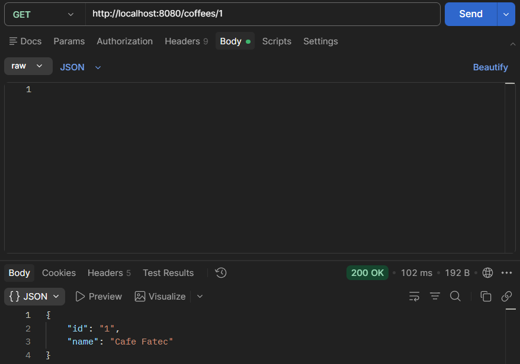
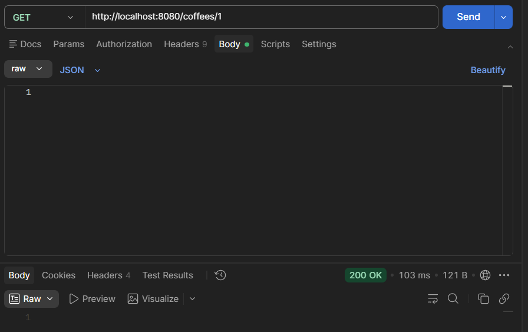
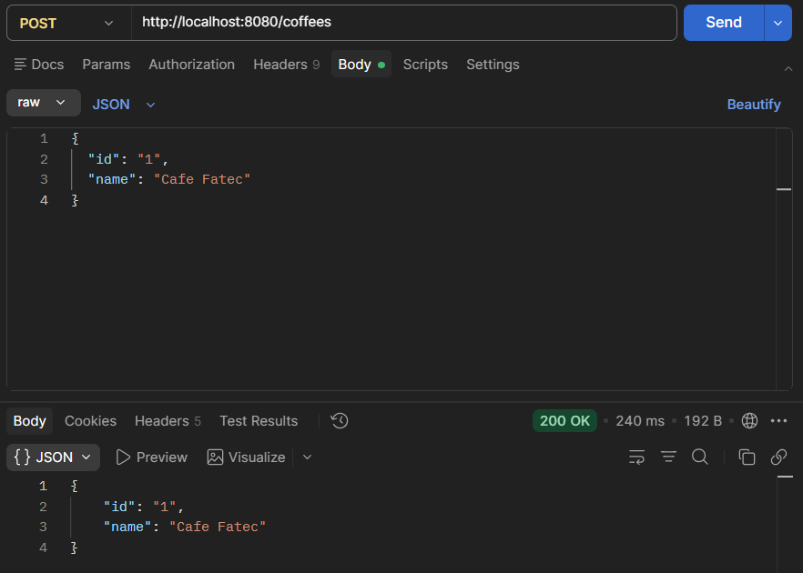
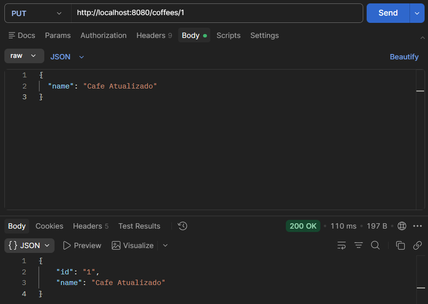
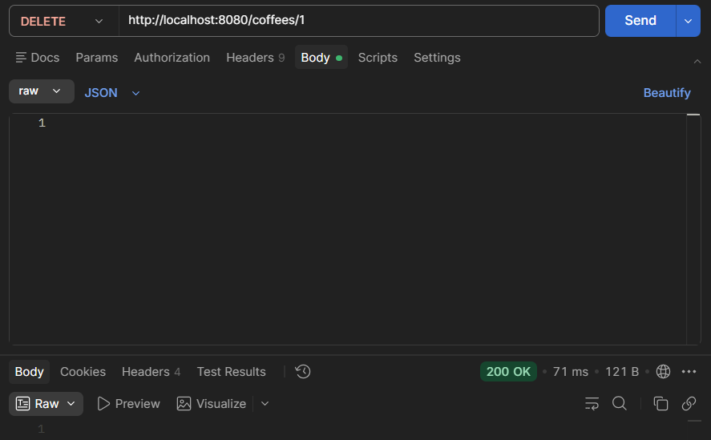

# BERTOTI REPOSITÓRIO

---

## 📌 Descrição

Este repositório foi criado para compartilhar os projetos desenvolvidos em sala de aula pelos alunos com a ajuda do professor Bertoti.

---

# PROJETO 01

---

# ☕ Coffee API - Spring Boot

## 📌 Descrição

Este projeto consiste no desenvolvimento de uma API REST utilizando **Java com Spring Boot**, com o objetivo de gerenciar cafés através de operações CRUD (Create, Read, Update, Delete).

A aplicação permite cadastrar, consultar, atualizar e remover cafés armazenados em banco de dados.

---

## 🚀 Tecnologias Utilizadas

- Java 17  
- Spring Boot  
- Spring Data JPA  
- Maven  
- Banco de Dados (H2 / Oracle)  
- Postman  

---

## 🧠 Arquitetura

A aplicação segue o padrão:

Cliente → API → Banco de Dados

- **Controller** → recebe as requisições HTTP  
- **Repository** → acessa o banco de dados  
- **Model** → representa os dados  

---

## 📂 Estrutura do Projeto

```

src
├── controller
├── model
├── repository
└── CoffeApiApplication.java

````

---

## 📌 Modelo de Dados

### Coffee

```json
{
  "id": "1",
  "name": "Cafe Fatec"
}
````

---

## 🔗 Endpoints da API

### 📋 Listar todos os cafés

* **GET** `/coffees`



---

### 🔍 Buscar café por ID

* **GET** `/coffees/{id}`



---

### ➕ Criar novo café

* **POST** `/coffees`

```json
{
  "id": "1",
  "name": "Cafe Fatec"
}
```



---

### ✏️ Atualizar café

* **PUT** `/coffees/{id}`

```json
{
  "name": "Cafe Atualizado"
}
```




---

### ❌ Remover café

* **DELETE** `/coffees/{id}`



---

## 🧪 Testes

Os testes da API foram realizados utilizando o Postman, validando todas as operações:

* ✔️ Criação de café (POST)
* ✔️ Listagem de cafés (GET)
* ✔️ Busca por ID (GET)
* ✔️ Atualização (PUT)
* ✔️ Remoção (DELETE)

---

## ▶️ Como executar o projeto

1. Abrir o projeto no IntelliJ
2. Executar a classe principal `CoffeApiApplication`
3. A API estará disponível em:

```
http://localhost:8080
```

---

## 🏁 Conclusão

Este projeto permitiu aplicar na prática conceitos de API REST, protocolo HTTP e integração com banco de dados, utilizando o framework Spring Boot.
Também foi possível validar o funcionamento da aplicação através de testes com o Postman.

---


# 🟣 Projeto 02 – Frontend Interativo

Após o desenvolvimento da API REST com Spring Boot, foi criada uma interface visual utilizando **HTML, CSS e JavaScript**, inspirada no estilo de jogos como *Papa’s*.

O objetivo deste projeto é proporcionar uma experiência mais visual e interativa para o usuário, consumindo a API desenvolvida anteriormente.

---

## 🎮 Sobre o Projeto

Este frontend simula uma pequena cafeteria, onde o usuário pode:

☕ Adicionar novos cafés
📋 Visualizar todos os cafés cadastrados
❌ Remover cafés da lista

Tudo isso de forma dinâmica e integrada com a API REST.

---

## 🧡 Funcionalidades Implementadas

* Integração com API Spring Boot (`fetch`)
* Interface estilizada inspirada em jogos
* Lista dinâmica com atualização automática
* Botões interativos com feedback visual
* Exclusão de itens em tempo real

---

## 🖥️ Tecnologias Utilizadas

* HTML5
* CSS3
* JavaScript
* API REST (Spring Boot)

---

## ⚙️ Como Executar o Projeto

### 1️⃣ Rodar o Backend (Spring Boot)

Abra o projeto no IntelliJ e execute a aplicação:

▶️ Run na classe principal (`CoffeeApiApplication`)

A API estará disponível em:

```
http://localhost:8080/coffees
```

---

### 2️⃣ Rodar o Frontend

Abra o arquivo:

```
index.html
```

Você pode:

* Clicar duas vezes no arquivo
  ou
* Botão direito → **Open with Browser**

---

## 🎥 Demonstração

Adicione aqui prints do funcionamento:


---

## 🚀 Integração Frontend + Backend

O sistema funciona da seguinte forma:

Frontend (JavaScript) → faz requisições HTTP → API Spring Boot → Banco de Dados

Exemplo de requisição utilizada:

```javascript
fetch("http://localhost:8080/coffees")
```

---

## ✨ Destaques do Projeto

✔ Aplicação completa (Full Stack)
✔ Integração real entre frontend e backend
✔ Interface interativa com animações
✔ Simulação de experiência de usuário estilo jogo

---

## 📌 Observações

* É necessário que o backend esteja rodando para o frontend funcionar corretamente
* O projeto utiliza dados em tempo real via API
* Pode ser expandido para incluir sistema de pedidos e pontuação

---

## 👩‍💻 Autora

**Giovanna Marques**
📌 Estudante de Banco de Dados - FATEC


