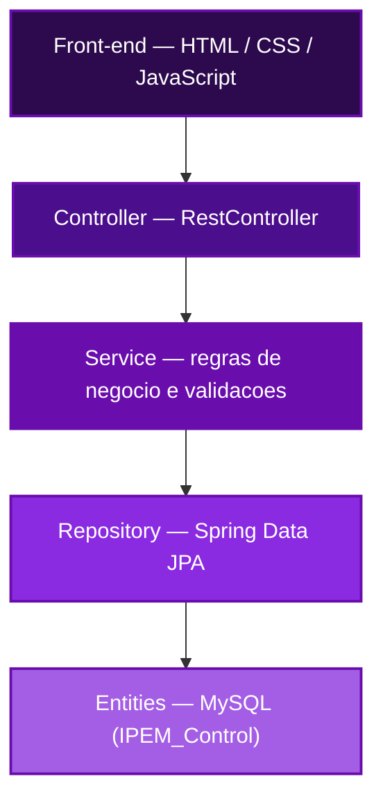
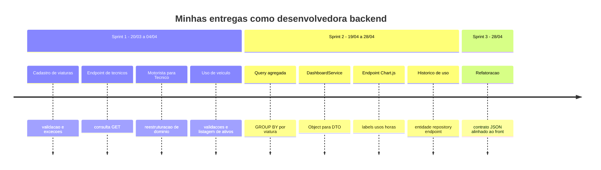

<div align="center">


[](https://www.linkedin.com/in/giovanna-marques-221998397)
[](mailto:giovannamrodrigues2006@gmail.com)
[](https://github.com/Markeis24)

</div>


## Índice

```txt
01. Sobre mim
02. Trajetória até a FATEC
03. Estágio e atuação profissional
04. Stack e nível de domínio
05. Projeto em destaque — IPEM Control
06. Arquitetura da solução
07. Minhas entregas, sprint a sprint
08. Contribuições técnicas em detalhe
09. Desafios técnicos enfrentados
10. Competências desenvolvidas
11. Contato
```


## 01 · Sobre mim

```java
public class Giovanna {

    private final String curso        = "Tecnologia em Banco de Dados";
    private final String instituicao  = "FATEC São José dos Campos";
    private final int    ingresso     = 2025;
    private final int    semestreAtual = 3;

    private final List<String> foco = List.of(
            "Back-end", "Front-end", "Administração de Banco de Dados (DBA)"
    );

    private final Estagio estagio = new Estagio(
            "Tudo de Bicho",
            List.of("Java", "Oracle", "ERP Sankhya")
    );

    record Estagio(String empresa, List<String> stack) {}
}
```

Sou estudante de Tecnologia em Banco de Dados na FATEC São José dos Campos, com atuação prática tanto em desenvolvimento back-end quanto em modelagem e administração de bancos de dados. Concilio a graduação com um estágio em que trabalho diariamente com Java em ambiente corporativo, o que me deu uma base sólida antes mesmo de encarar meu primeiro projeto acadêmico de maior porte em Spring Boot.


## 02 · Trajetória até a FATEC

```txt
ensino_medio
  └─ itinerário formativo com lógica de programação e algoritmos
       └─ caravanas científicas — Universidade Federal de São Paulo (UNIFESP)
            └─ convite para curso preparatório de vestibular pela própria UNIFESP
                 └─ aprovação simultânea em UNIFESP e FATEC
                      └─ escolha pela FATEC após comparar matriz curricular
                           └─ ingresso em Tecnologia em Banco de Dados — 2025
```

Minha trajetória na área de tecnologia começou ainda no ensino médio, por meio do itinerário formativo que oferecia aulas de lógica de programação e algoritmos. Paralelamente, participei ativamente de caravanas científicas promovidas pela UNIFESP e, por conta desse engajamento, fui convidada a integrar um curso preparatório para o vestibular organizado pela própria instituição. Motivada pela presença do campus de São José dos Campos e pela oferta de cursos na área tecnológica, direcionei meus estudos com o objetivo de ingressar na universidade.

Fui aprovada tanto na UNIFESP quanto no processo seletivo da FATEC, para o curso superior de Tecnologia em Banco de Dados. Depois de uma análise aprofundada da matriz curricular e das metodologias de ensino das duas instituições, identifiquei um maior alinhamento do perfil da FATEC com meus objetivos pessoais e profissionais, e optei por consolidar minha formação acadêmica nela. Ingressei em 2025 e, desde então, venho aprimorando minhas competências técnicas com foco em desenvolvimento back-end, front-end e administração de banco de dados — uma combinação que se mostrou essencial na atuação que teria, um semestre depois, no projeto detalhado mais abaixo.


## 03 · Estágio e atuação profissional

No terceiro semestre da graduação — o mesmo período em que atuei no projeto IPEM Control — iniciei minha atuação como estagiária na empresa **Tudo de Bicho**, onde permaneço até o momento.

```yaml
empresa: Tudo de Bicho
plataforma: ERP Sankhya
atividades:
  - otimização de código já existente
  - melhoria de rotinas em produção
ecossistema:
  linguagem: Java
  banco_de_dados: Oracle
ganho_principal: >
  vivência prática e aprofundada em Java corporativo e em
  gestão de bancos Oracle, aplicada depois ao projeto acadêmico
```

Essa vivência profissional foi essencial para minha atuação no projeto acadêmico: o contato diário com Java em ambiente corporativo me deu segurança para propor soluções, refatorar código já existente e discutir decisões de arquitetura com o restante da equipe — ainda que o IPEM Control fosse meu primeiro projeto em uma stack Spring Boot construída do zero, junto com uma squad.


## 04 · Stack e nível de domínio

<div align="center">

</div>

<br>

<table>
<tr>
<td width="50%" valign="top">

**Hard skills**

```yaml
java:       "████████░░"  80%
spring:     "██████░░░░"  60%
sql:        "███████░░░"  70%
banco_dba:  "███████░░░"  70%
postman:    "█████████░"  90%
maven:      "██████░░░░"  60%
intellij:   "██████████" 100%
```

</td>
<td width="50%" valign="top">

**Soft skills**

```yaml
comunicacao:         "█████████░"  90%
trabalho_em_equipe:  "██████████" 100%
pensamento_critico:  "████████░░"  80%
adaptabilidade:      "█████████░"  90%
resiliencia:         "██████████" 100%
```

</td>
</tr>
</table>

| Ferramenta | Onde apliquei |
|---|---|
| `Java 21` | Todos os módulos backend que desenvolvi — controllers, services, repositories e entidades |
| `Spring Boot 3.2` | Estrutura REST, injeção de dependência (`@Autowired`), camadas MVC |
| `Spring Data JPA` | Repositories com métodos derivados e consultas `@Query` nativas |
| `MySQL` | Modelagem de tabelas e escrita de queries agregadas (`GROUP BY`, `JOIN`, `SUM`, `COUNT`) |
| `Postman` | Validação manual de cada endpoint antes da integração com o front-end |
| `IntelliJ IDEA` | IDE principal de desenvolvimento no projeto e no estágio |
| `Git / GitHub` | Fluxo com branches por sprint, commits semânticos e resolução de merges |


## 05 · Projeto em destaque — IPEM Control

<div align="center">

### Sistema de Controle e Análise de Abastecimento das Viaturas do IPEM

*Regional de São José dos Campos*

[](https://github.com/SquadTech-API/API3_BACKEND)
[](https://github.com/SquadTech-API/API3_FRONTEND)
[](https://github.com/SquadTech-API)
[](https://www.ipem.sp.gov.br)

</div>

#### O problema

```txt
antes:
  condutor    → anota km, litros, valor e identificação em prancheta física
  diretor     → recolhe todas as pranchetas manualmente
              → confere cada anotação uma por uma
              → digita tudo no sistema corporativo SGI

consequência:
  - impossível comparar viaturas rapidamente
  - consumo médio de combustível sem visibilidade
  - inconsistências só descobertas tarde demais
```

O controle de abastecimento da frota do IPEM era feito inteiramente em pranchetas físicas dentro de cada veículo. Ao final de cada período, o Diretor da unidade precisava reunir manualmente todas as anotações, conferi-las individualmente e só então consolidar os dados para digitação no SGI. Esse fluxo comprometia a eficiência da gestão: análises comparativas entre viaturas, acompanhamento do consumo médio e identificação de inconsistências levavam tempo demais para acontecer.

#### A solução da squad

```txt
depois:
  condutor    → registra abastecimento direto no sistema web
  sistema     → valida os dados na entrada
              → estrutura tudo em banco relacional
  gestor      → acessa dashboards e relatórios analíticos prontos
              → exporta em PDF, Excel, CSV ou Word quando precisa
```

A equipe construiu uma aplicação web dividida em backend (Java + Spring Boot, responsável pela API REST, regras de negócio e persistência) e frontend (HTML, CSS e JavaScript, consumindo a API). O sistema contempla cadastro de viaturas e técnicos, abertura e fechamento de registros de saída com cálculo automático de quilometragem, registro de abastecimentos, controle de trocas de óleo com alertas preventivos, e um conjunto de relatórios e dashboards analíticos exportáveis.

#### Tecnologias Utilizadas
>

> - **Java 21**: Linguagem base de todo o backend, utilizada na implementação de controllers, services, repositories e entidades JPA.
> - **Spring Boot 3.2**: Framework responsável pela estrutura REST da aplicação, pela injeção de dependência (`@Autowired`) e pela organização em camadas MVC.
> - **Spring Data JPA**: Camada de persistência, combinando métodos derivados de nome de repository com consultas nativas (`@Query`) para as agregações mais complexas do dashboard.
> - **MySQL**: Banco relacional do projeto, acessado via Hibernate e via SQL nativo nas consultas de relatório.
> - **Postman**: Utilizado para validar manualmente cada endpoint que desenvolvi antes da integração com o time de front-end.
> - **Git e GitHub**: Controle de versão em fluxo por sprint (branches `Sprint-1`, `Sprint-2`...), com commits referenciando o número da issue trabalhada.


## 06 · Arquitetura da solução



O backend segue arquitetura em camadas: o **Controller** recebe a requisição HTTP e devolve DTOs — nunca a entidade JPA diretamente, evitando expor o modelo interno e problemas de serialização em relacionamentos. O **Service** concentra as regras de negócio, como impedir que um técnico abra uma nova saída enquanto já tem outra em andamento. O **Repository**, sobre Spring Data JPA, combina métodos derivados de nome com consultas nativas mais elaboradas, usadas nos relatórios agregados. As **Entities** mapeiam as tabelas do MySQL, com relacionamentos `@ManyToOne` conectando Registro de Saída, Veículo e Técnico.


## 07 · Minhas entregas, sprint a sprint



### Sprint 1 — Fundação do sistema

| Data | Issue | Entrega |
|---|---|---|
| 20/03 | `#16` `#18` | Implementação do cadastro de viaturas, com validação de campos obrigatórios e tratamento de exceções de negócio |
| 25/03 | `#20` `#22` | Criação da tabela de Técnicos e do endpoint GET de consulta |
| 02/04 | `#A01` | Cadastro e gerenciamento de motoristas (Entity, Repository, Service) |
| 02/04 | `#A03.2B` | Unificação de "Motorista" em "Técnico", refletindo a regra de negócio real do IPEM |
| 03/04 | `#A03.B` | Registro de uso de viatura, com validações e endpoint de listagem de veículos ativos |
| 04/04 | — | Ajustes de infraestrutura (`.gitignore`) e correção de erros na entidade `Veiculo` e seu controller |

### Sprint 2 — Dashboard analítico e histórico de uso

| Data | Issue | Entrega |
|---|---|---|
| 19/04 | `#A07.1B` | Query nativa no repository, agrupando uso por viatura com `GROUP BY` e agregações `SUM`/`COUNT` |
| 19/04 | `#A07.2B` | `DashboardService`, transformando o `Object[]` retornado pela query em DTOs tipados |
| 19/04 | `#A07.3B` | Formatação do endpoint comparativo já no formato consumido pelo Chart.js no front-end |
| 27/04 | `#T04.1B` | Entidade `HistoricoUso` e repository ordenado pela data mais recente |
| 28/04 | `#T04.3B` | Endpoint completo de histórico por viatura (Controller, Service, DTO) |

### Sprint 3 — Refino e integração com o front-end

| Data | Issue | Entrega |
|---|---|---|
| 28/04 | `#T04` | Refatoração do endpoint de histórico com base no contrato de dados definido pela equipe de front-end |


## 08 · Contribuições técnicas em detalhe

Nesta seção, aprofundo tecnicamente as entregas mais relevantes das tabelas acima, com o código real que escrevi e o raciocínio por trás de cada decisão.

<details>
  <summary>Cadastro de viaturas — modelagem da entidade e regras de integridade (Sprint 1, #16 #18)</summary>

```java
@Entity
@Table(name = "veiculo")
public class Veiculo {

    @Id
    @GeneratedValue(strategy = GenerationType.IDENTITY)
    private Integer idVeiculo;

    @Column(nullable = false, length = 20)
    private String prefixo;

    @Column(nullable = false, unique = true, length = 10)
    private String placa;

    @Column(nullable = false)
    private Boolean disponivel = true;

    @Column(nullable = false)
    private Boolean ativo = true;

    @PrePersist
    public void prePersist() {
        this.createdAt = LocalDateTime.now();
        if (this.ativo == null) this.ativo = true;
        if (this.disponivel == null) this.disponivel = true;
    }
}
```

Comecei o desenvolvimento do backend justamente pelo cadastro de viaturas, já que praticamente todos os outros módulos do sistema — uso de veículo, abastecimento, troca de óleo, relatórios — dependem dessa entidade estar bem modelada. Defini `placa` como campo `unique`, evitando duplicidade de cadastro no nível do próprio banco, e não apenas na camada de aplicação. Os campos `disponivel` e `ativo` foram pensados para resolver dois problemas de negócio distintos: `disponivel` controla se o veículo está em uso agora (mudando dinamicamente a cada saída/retorno), enquanto `ativo` controla se ele ainda faz parte da frota operacional — um veículo pode estar inativo (baixado) mas manter seu histórico de uso íntegro no banco. O `@PrePersist` garante que, mesmo que o front-end não envie esses dois campos explicitamente, o registro nunca é salvo em um estado inconsistente (nulo), o que evitaria `NullPointerException` em qualquer regra de negócio que dependesse desses booleanos mais adiante.
</details>

<details>
  <summary>Registro de uso de viatura — impedindo uso simultâneo do mesmo veículo (Sprint 1, #A03.B)</summary>

```java
public UsoVeiculoDTO registrar(UsoVeiculoDTO dto) {

    Tecnico tecnico = tecnicoRepository.findById(dto.getTecnicoId())
            .orElseThrow(() -> new RuntimeException("Technician not found"));

    boolean emUso = usoRepository.existsByVeiculoAndDataFimIsNull(dto.getVeiculo());

    if (emUso) {
        throw new RuntimeException("Vehicle already in use");
    }

    UsoVeiculo uso = new UsoVeiculo();
    uso.setTecnico(tecnico);
    uso.setVeiculo(dto.getVeiculo());
    uso.setDataInicio(dto.getDataInicio());

    uso = usoRepository.save(uso);
    ...
}
```

Este foi o primeiro módulo em que precisei pensar em uma regra de concorrência real: dois técnicos não podem registrar uso do mesmo veículo ao mesmo tempo. Resolvi isso sem precisar de lock explícito no banco, usando a própria semântica do domínio — um uso "em aberto" é aquele em que `dataFim` ainda é nulo. Criei o método derivado `existsByVeiculoAndDataFimIsNull` no repository, que o Spring Data JPA traduz automaticamente para uma consulta `WHERE veiculo = ? AND data_fim IS NULL`, e uso o resultado como guarda de negócio antes de qualquer persistência. Essa abordagem também foi a base para o endpoint de listagem de veículos ativos (`GET /uso-veiculos/em-uso`), que reaproveita o mesmo predicado para trazer todos os usos em aberto no momento da consulta.
</details>

<details>
  <summary>Query nativa de agregação por viatura — base do dashboard comparativo (Sprint 2, #A07.1B)</summary>

```java
@Query(value = """
    SELECT 
        vehicle,
        COUNT(*) AS total_usos,
        SUM(TIMESTAMPDIFF(HOUR, data_inicio, data_fim)) AS horas_uso
    FROM uso_veiculo
    WHERE data_fim IS NOT NULL
    GROUP BY vehicle
    ORDER BY total_usos DESC
""", nativeQuery = true)
List<Object[]> buscarComparativoUso();
```

Esta foi a consulta mais elaborada que escrevi no projeto. O Spring Data JPA resolve bem consultas simples com métodos derivados de nome, mas para agregação com `GROUP BY` e cálculo de intervalo de tempo entre duas colunas (`TIMESTAMPDIFF`) optei por uma `@Query` nativa, escrevendo o SQL diretamente. Filtrar por `data_fim IS NOT NULL` garante que apenas usos já concluídos entrem no cálculo de horas — um uso ainda em andamento não tem duração definida e distorceria a média. O retorno como `List<Object[]>` é a limitação natural de uma consulta nativa que não mapeia para uma entidade única; tratar essa lista bruta e transformá-la em algo utilizável ficou por conta do `DashboardService`, descrito no próximo tópico.
</details>

<details>
  <summary>DashboardService — traduzindo o resultado bruto da query em DTOs tipados (Sprint 2, #A07.2B)</summary>

```java
public DashboardGraficoDTO buscarComparativo() {
    List<Object[]> resultados = usoVeiculoRepository.buscarComparativoUso();

    List<String> labels = new ArrayList<>();
    List<Long> usos = new ArrayList<>();
    List<Double> horas = new ArrayList<>();

    for (Object[] row : resultados) {
        labels.add((String) row[0]);
        usos.add(((Number) row[1]).longValue());
        horas.add(row[2] != null ? ((Number) row[2]).doubleValue() : 0.0);
    }

    return new DashboardGraficoDTO(labels, usos, horas);
}
```

Considero esta a peça central do módulo de dashboard: é aqui que a complexidade da query SQL fica isolada do resto da aplicação. Cada `Object[]` retornado pela consulta nativa vem sem tipo definido — a posição 0 é o nome do veículo, a 1 é a contagem, a 2 é a soma de horas — então percorro a lista fazendo o cast explícito para cada tipo esperado. Um cuidado importante aqui foi tratar `row[2]` como potencialmente nulo: se um veículo aparece no agrupamento mas nunca teve um uso com `data_fim` preenchida, o `SUM` do SQL pode retornar `NULL`, e sem essa checagem o `((Number) row[2]).doubleValue()` lançaria `NullPointerException` direto em produção. Optei por usar três listas paralelas (`labels`, `usos`, `horas`) em vez de uma lista de objetos porque é exatamente o formato que o Chart.js espera para montar um gráfico de barras comparativo no front-end, o que evita qualquer transformação adicional do lado do cliente.
</details>

<details>
  <summary>Endpoint do dashboard formatado para consumo direto pelo Chart.js (Sprint 2, #A07.3B)</summary>

```java
public class DashboardGraficoDTO {

    private List<String> labels;
    private List<Long> usos;
    private List<Double> horas;

    public DashboardGraficoDTO(List<String> labels, List<Long> usos, List<Double> horas) {
        this.labels = labels;
        this.usos = usos;
        this.horas = horas;
    }
    // getters
}
```
```java
@RestController
@RequestMapping("/dashboard")
public class DashboardController {

    private final DashboardService service;

    public DashboardController(DashboardService service) {
        this.service = service;
    }

    @GetMapping("/comparativo")
    public DashboardGraficoDTO comparativo() {
        return service.buscarComparativo();
    }
}
```

Fechei o módulo de dashboard desenhando o DTO de resposta já pensando em quem ia consumi-lo do outro lado: o front-end. Em vez de devolver uma lista de objetos genérica, estruturei `DashboardGraficoDTO` em três arrays paralelos — decisão que só fez sentido depois que testei no Postman como o Chart.js espera receber `labels`, `datasets` e valores numéricos separadamente. O `DashboardController` ficou propositalmente enxuto: qualquer lógica de tratamento de dado mora no `Service`, o controller apenas expõe o endpoint HTTP `GET /dashboard/comparativo` e delega. Essa separação foi o que me permitiu, mais tarde, reaproveitar o mesmo `DashboardService` sem tocar no controller quando precisei revisar o cálculo de horas.
</details>

<details>
  <summary>Histórico de uso por viatura — da entidade dedicada ao cálculo direto sobre registro_saida (Sprint 2 → Sprint 3, #T04.1B, #T04.3B, #T04)</summary>

```java
public List<HistoricoUsoCardDTO> listarHistoricoPorVeiculo(Integer idVeiculo) {

    List<RegistroSaida> saidas = registroSaidaRepository
            .findByVeiculoIdVeiculoAndDataHoraSaidaBetween(
                    idVeiculo,
                    LocalDateTime.now().minusYears(5),
                    LocalDateTime.now()
            );

    return saidas.stream()
            .sorted((a, b) -> {
                if (a.getDataHoraSaida() == null) return 1;
                if (b.getDataHoraSaida() == null) return -1;
                return b.getDataHoraSaida().compareTo(a.getDataHoraSaida());
            })
            .map(saida -> {
                String motorista = saida.getUsuario() != null ? saida.getUsuario().getNome() : "—";
                String tipoServico = saida.getTipoServico() != null ? saida.getTipoServico().getNomeServico() : "—";
                BigDecimal kmRodados = saida.getKmRodados() != null ? saida.getKmRodados() : BigDecimal.ZERO;

                List<Abastecimento> abastecimentos = abastecimentoRepository.findByRegistroSaida(saida);
                boolean abasteceu = !abastecimentos.isEmpty();

                return new HistoricoUsoCardDTO(motorista, saida.getDataHoraSaida(), tipoServico, kmRodados, abasteceu);
            })
            .collect(Collectors.toList());
}
```

Este módulo teve a trajetória mais interessante do projeto do ponto de vista de aprendizado. Na Sprint 2, criei a entidade `HistoricoUso` como uma tabela dedicada, pensando em registrar eventos de uso de forma independente. Quando o time de front-end fechou o contrato definitivo de dados na Sprint 3, ficou claro que o histórico completo por viatura precisava combinar informações que já existiam espalhadas em outras tabelas — quem dirigiu, qual serviço foi feito, quantos km rodou e se houve abastecimento naquela saída — e não fazia sentido duplicar esses dados em uma tabela própria, sob risco de ficarem dessincronizados. Refatorei o serviço para calcular o histórico dinamicamente a partir de `RegistroSaida`, cruzando com `Abastecimento` via `findByRegistroSaida` para decidir o booleano `abasteceu`, que o front-end usa para destacar a linha em verde. Um detalhe da ordenação: o comparador trata explicitamente saídas com `dataHoraSaida` nula, jogando-as para o fim da lista em vez de deixar o `compareTo` lançar `NullPointerException` — um erro que só apareceria em produção, com dados reais incompletos, e não nos testes manuais do Postman com dados sempre preenchidos.
</details>


## 09 · Desafios técnicos enfrentados

```txt
[1] consultas SQL agregadas
    entender a diferença entre JPQL derivada e query nativa
    retornando Object[], tratando conversões de tipo (Number
    para Long e Double) na montagem dos DTOs.

[2] reestruturação de domínio em produção de código
    unificar "Motorista" e "Técnico" no meio da Sprint 1 exigiu
    refatorar entidades e repositories já usados por outras
    partes do sistema, sem quebrar o que os colegas já haviam
    construído sobre essa base.

[3] sincronização de contrato com o front-end
    uma mudança no formato esperado pelo front exigiu revisar
    e ajustar um endpoint já entregue, reforçando a importância
    de validar contratos de API antes da integração final.

[4] integridade dos relacionamentos JPA
    erros de mapeamento na entidade Veiculo e seu controller
    exigiram depurar @ManyToOne e @JoinColumn até eliminar
    exceções de referência nula.
```


## 10 · Competências desenvolvidas

#### Hard Skills

- **Java** : Sei fazer com autonomia
- **Spring Boot** : Sei fazer com autonomia
- **Spring Data JPA** : Sei fazer com autonomia
- **SQL (consultas agregadas)** : Sei fazer com autonomia
- **Postman** : Sei fazer com autonomia
- **Git/GitHub (fluxo por sprint)** : Sei fazer com autonomia
- **Maven** : Sei fazer com ajuda

#### Soft Skills

**Comunicação**: Mantive alinhamento constante com a equipe de front-end para definir o contrato de dados dos endpoints que desenvolvi — nomes de campos, formatos de data, estrutura do JSON —, o que se tornou especialmente necessário na refatoração do módulo de histórico de uso, quando o formato esperado pelo front mudou depois que o endpoint já estava em produção.

**Trabalho em equipe e colaboração**: Integrei meu código ao de outros desenvolvedores da squad ao longo das três sprints, revisando e resolvendo conflitos de merge sem interromper o fluxo de entrega, especialmente nos módulos que dependiam da entidade `Veiculo`, tocada por mais de uma pessoa do time.

**Pensamento crítico e resolução de problemas**: Identifiquei, ainda na Sprint 1, que o sistema mantinha os conceitos de "Motorista" e "Técnico" como entidades separadas sem que essa distinção existisse na operação real do IPEM. Propus e implementei a unificação desses domínios, o que evitou duplicidade de cadastro e inconsistência de dados nas sprints seguintes.

**Adaptabilidade e flexibilidade**: Refatorei o módulo de histórico de uso de uma abordagem baseada em entidade dedicada para um cálculo dinâmico sobre `RegistroSaida` quando o contrato de dados definido pelo front-end tornou a primeira abordagem inadequada, sem comprometer o cronograma da sprint em andamento.

**Resiliência**: Persisti na depuração de erros de integridade em relacionamentos JPA — como referências nulas na entidade `Veiculo` e em seu controller — revisando anotações `@ManyToOne` e `@JoinColumn` até a estabilização completa do módulo.


## 11 · Contato

<div align="center">

[](https://www.linkedin.com/in/giovanna-marques-221998397)
[](mailto:giovannamrodrigues2006@gmail.com)
[](https://github.com/Markeis24)


</div>
